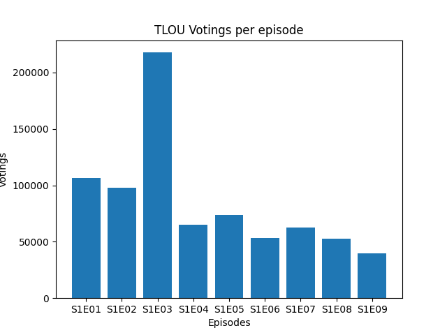
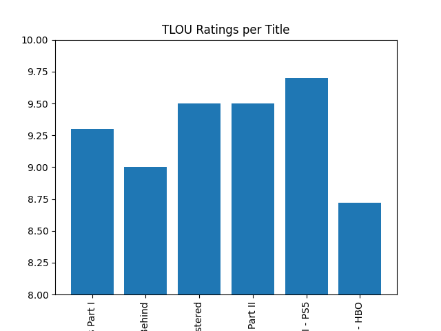

# The Last of Us Overview

Desde a primeira vez que tive contato com o Joel e com a Ellie em The Last of Us fiquei apaixonado pela sua forma de retratar um cenário apocalíptico. Inspirado em uma análise da série [The Office](https://github.com/cesargaglioni/TheOfficeIMDB), decidi fazer uma análise de dados coletados da série de The Last of Us e um comparativo das notas da série com os jogos que a inspiraram.

## The Last of Us - HBO

Os dados da série da HBO foram coletados no site do IMDB utilizando a biblioteca BeautifulSoup e foram tratados para serem transformados em um dataframe.

Como a série ainda está em andamento, há uma verificação onde apenas os episódios lançados até a data de execução estão no dataframe.

### Notas e Votações

Nesse gráfico podemos ver a nota de cada um dos episódios da série, e logo em seguida um gráfico com a quantidade de votos em cada um deles. A quantidade de votações tende a ser menor a cada episódio, levando em conta que eles são lançados semanalmente.

É perceptível a discrepância que há no terceiro episódio da série. Mais votos que o esperado e uma nota muito mais baixa em relação aos outros episódios.

O terceiro episódio da série conta a história de Bill e seu parceiro Frank, amigos de longa data de Joel. O capítulo foi, lamentavelmente, alvo de ataques homofóbicos, o que baixou consideravelmente a nota da série no IMDB. Não há mais espaço para isso, e The Last of Us mostra de uma maneira brilhante como o amor consegue estar presente em todas as situações, mesmo com o Cordyceps por aí :) 

## ChatGPT

Para obter os dados dos jogos, obtive ajuda do [ChatGPT](https://chat.openai.com/). Pedi os dados dos jogos, contando com a DLC Left Behind, e que ele me gerasse um arquivo .csv que pudesse ser utilizado. A conversa foi transformada em HTML utilizando um [script](https://github.com/jcubic/chat-gpt).

## Jogos + Série

Com os dados de todos os jogos transformados em dataframe, adicionei a série da HBO, utilizando a média dos epísodios como a sua nota, e gerei a seguinte visualização:

Podemos ver que em todos os títulos até então, a franquia The Last of Us obteve notas excelentes. A série tem a única nota menor que 9, mesmo com métodos de ranqueamento diferentes e situações atípicas, como a citada anteriormente.

The Last of Us é uma daquelas franquias que será tida por longos anos como referência, seja na TV ou no mercado de jogos. Os jogos estão disponíveis na Playstation Store (e em breve no PC) e a série é exclusiva da HBO. Vale a pena dar uma conferida para entender o fenômeno causado pela Ellie e pelo Joel :)

## Links

 - [The Office IMDB](https://github.com/cesargaglioni/TheOfficeIMDB)
 - [Homofóbicos avaliam o 3° episódio de The Last of Us com notas ruins](https://www.tecmundo.com.br/voxel/260124-homofobicos-avaliam-3-episodio-the-last-of-us-notas-ruins.htm)
 - [ChatGPT to HTML](https://github.com/jcubic/chat-gpt)

